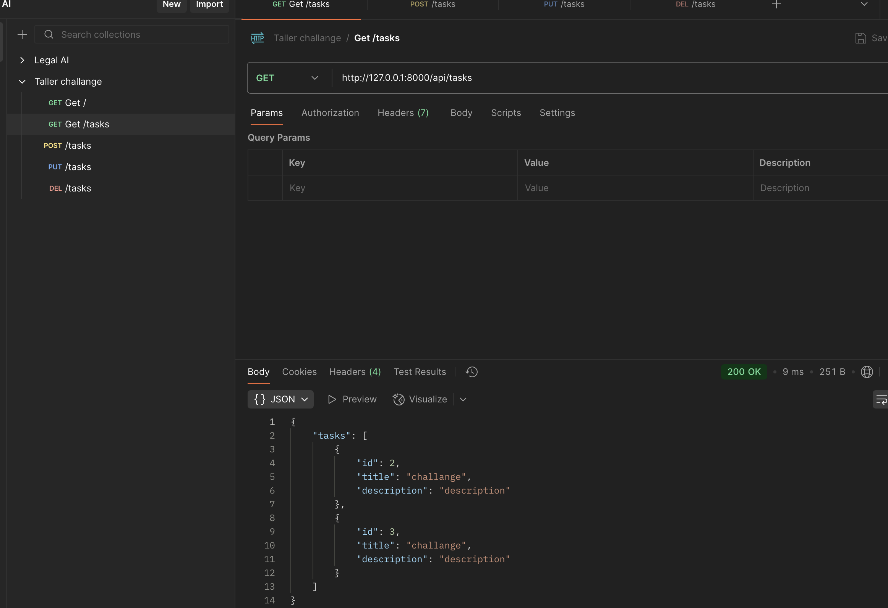
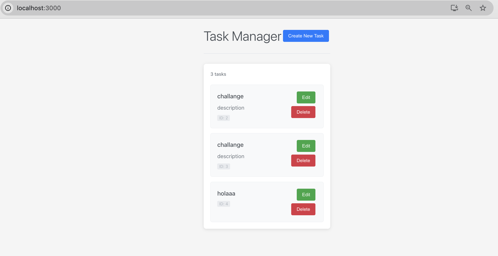

# Taller Challange

# Postgress locally

```bash
docker pull postgres
```

*Run postgress*

```bash
    docker run --name my-postgres -p 5432:5432 -e POSTGRES_PASSWORD=password -v $(pwd)/db/init.sql:/docker-entrypoint-initdb.d/init.sql postgres
```

# Backend 

URL: http://localhost:8000

```bash
uv sync
uv run fastapi dev src/api
```



# Frontend

URL: http://localhost:3000

```bash
cd frontend
npm install
npm run start
```


# Postman collection

URL: http://localhost:3000
Locate: doc/Taller challange.postman_collection.json